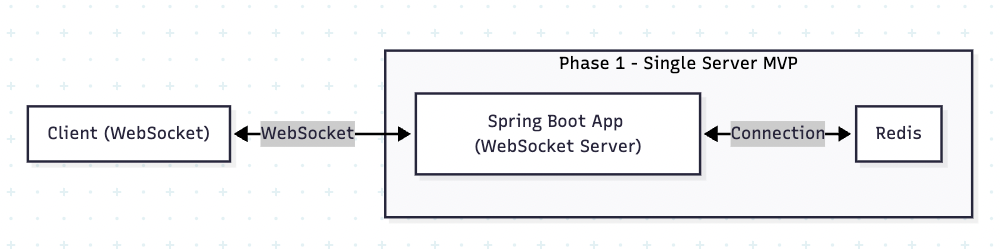
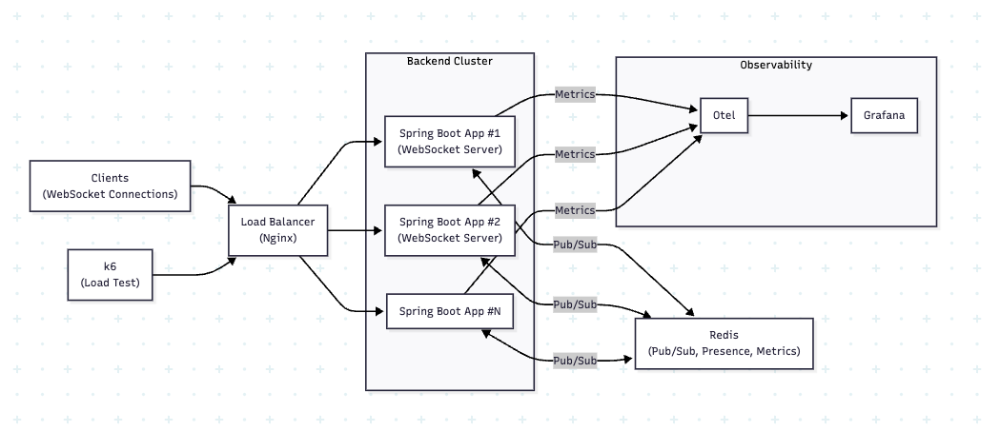

# live-platform-lab

live-platform-lab은 라이브 스트리밍 플랫폼 환경을 가정하고,  
실시간 채팅 시스템을 중심으로 한 백엔드 아키텍처, 확장 구조, 그리고 관측 가능성(Observability)을 직접 설계·구현·검증하는 포트폴리오 프로젝트입니다.

단일 서버 기반 MVP부터 시작하여, Redis Pub/Sub을 활용한 멀티 인스턴스 확장,  
동접자 관리, 실시간 지표 수집, 부하 테스트 기반 병목 분석까지 단계적으로 발전시키는 것을 목표로 합니다.

---

## Phase 1 · 단일 서버 기반 MVP

Phase 1에서는 단일 서버 기준으로 **“라이브 룸 + 채팅” 기본 동작을 완성**하는 것을 목표로 합니다.

### 목표

- 플레이어가 포함된 라이브 룸 (roomId 기반)
- WebSocket 기반 실시간 채팅 (단일 서버 내 브로드캐스트)
- 기본 동접자 집계 (서버 메모리 기준 / 간단한 카운트)
- 로컬 실행 환경 구성
  - Docker Compose 구성: app + redis

### 사용 기술

**Backend**
- Java 21
- Spring Boot 4.0.1
- Spring WebSocket
- Redis

**Frontend (Simple UI)**
- HTML, CSS, Next.js

**Infra**
- Docker
- Docker Compose

---

## Phase 2 · 스케일아웃 & Observability

Phase 2에서는 **멀티 인스턴스 환경에서 채팅이 정상 동작하도록 확장하고, 운영 관점의 관측 가능성을 추가**하는 것을 목표로 합니다.

### 목표

- Redis Pub/Sub 기반 채팅 팬아웃
  - 메시지 publish / subscribe로 서버 간 브로드캐스트

- 멀티 인스턴스 백엔드 구성
  - 서버 2대 이상
  - 로드밸런서 (Nginx)

- Redis 기반 동접자 집계 (룸 단위)
  - presence / heartbeat 구조 설계 포함

- 실시간 지표 수집 및 시각화
  - OpenTelemetry + Prometheus + Grafana
  - 동접, 메시지율, 지연, 에러율, JVM 지표 중심

- 부하 테스트 및 병목 관측 (선택)
  - k6 기반 동접 / 메시지 폭주 시나리오
  - Phase 1 vs Phase 2 성능 비교 및 수치화

### 사용 기술

**Messaging / Scale-out**
- Redis Pub/Sub
- Redis (Presence / Metrics)

**Load Balancing**
- Nginx
- (선택) AWS Load Balancer

**Observability**
- OpenTelemetry
- Prometheus
- Grafana

**Load Test**
- k6

**Infra**
- Docker
- Docker Compose
